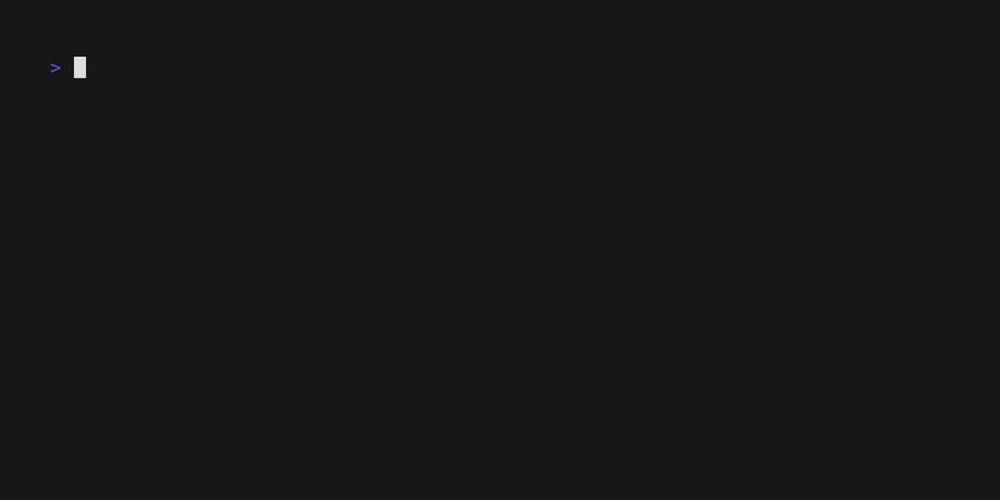

# mire

E2E tests for CLIs.

Problem: There isn't an easy way for testing e2e behavior on CLIs that is as simple as you recording a set of actions and ensuring future build replicate the ouput. What is ussually done is via code which doesn't convey visually what the test actually is.

> _mire tries to make it as simple as recording and replaying_

**Features**

- sandboxed
- fast, explicit, simple, enought that a 10s gif can demonstrate it entirely
- record, test, that's it
- start simple, tweak the entire environment if you want

## Quickstart

**Install**

- clone
- `make build`
- add `build/mire` to path

**Using**

- `mire init` to create the the single config file, every entry is explicit in config.
- `mire record test/name/` - now test how you would test manually, try out commands to see if they work as expected
- `mire test` or `mire test specific/test`
- `mire rewrite` - to rewrite all golden outputs in case of a style change

**Using fixtures?**
You can write you script commands in `setup.sh` at any level, anything at that and nested level will have those run before dropping you
into record.

## Other tools?

VHS comes close, which is what I initially tried for. It isn't suitable for testing as the output is terminal sessions captured as full frames in text. This makes it hard to know what the test is unless you watch it and even then it has timing issues, multiple blank frames polluting goldens, slow exection unless
you post process to limit all the sleeps, and also required you to handle the test environment/sandboxing yourself.
